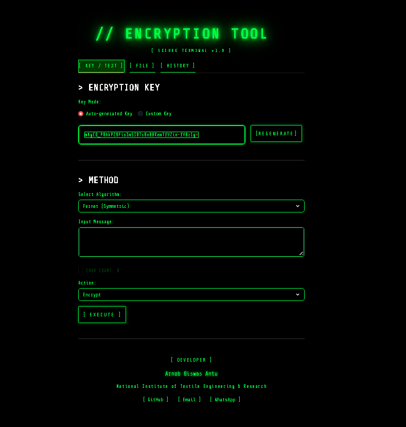

# 🔐 Encryption Tool

<div align="center">


**A hacker-themed encryption & decryption web app built with Python and Streamlit.**

[🚀 Live Demo](#) · [🐛 Report Bug](../../issues) · [💡 Request Feature](../../issues)

</div>

---

## 📸 Preview



---

## ✨ Features

- 🔑 **Fernet Encryption** — Strong symmetric encryption & decryption
- 🔡 **Caesar Cipher** — Classic shift-based encryption with custom shift value
- 🗝️ **Custom Key** — Use your own password to generate an encryption key
- 📋 **Copy Result** — Instantly copy encrypted/decrypted output
- 💾 **Download as .txt** — Save results as a text file
- 📷 **QR Code Generator** — Generate & download QR code of the result
- 📁 **File Encryption** — Upload and encrypt/decrypt `.txt` files
- 📜 **Operation History** — Track all encrypt/decrypt operations
- 🌊 **Matrix Rain Background** — Animated hacker-style background
- ⚡ **Loading Spinner** — Smooth processing animation
- 🎉 **Confetti Effect** — Celebratory animation on successful encryption
- ✨ **Fade-in Animations** — Smooth result reveal animations

---

## 🚀 Getting Started

### Prerequisites

Make sure you have **Python 3.8+** installed.

### Installation

**1. Clone the repository**
```bash
git clone https://github.com/arnobbiswasantu4049/encryption-tool.git
cd encryption-tool
```

**2. Create a virtual environment**
```bash
python -m venv .venv
.venv\Scripts\activate        # Windows
source .venv/bin/activate     # Mac/Linux
```

**3. Install dependencies**
```bash
pip install -r requirements.txt
```

**4. Run the app**
```bash
streamlit run encryption_tool.py
```

The app will open at `http://localhost:8501` 🎉

---

## 📦 Dependencies

```
streamlit
cryptography
qrcode[pil]
```

Or install all at once:
```bash
pip install streamlit cryptography qrcode[pil]
```

---

## 📁 Project Structure

```
encryption-tool/
│
├── message_encryp.py     # Main app file
├── requirements.txt       # Python dependencies
└── README.md              # Project documentation
```

---

## 🛠️ Built With

- [Python](https://www.python.org/) — Core language
- [Streamlit](https://streamlit.io/) — Web framework
- [Cryptography](https://cryptography.io/) — Fernet encryption
- [qrcode](https://pypi.org/project/qrcode/) — QR code generation

---

## 🌐 Deployment

This app is deployed on **Streamlit Community Cloud**.

To deploy your own:
1. Push code to GitHub
2. Go to [share.streamlit.io](https://share.streamlit.io)
3. Connect your GitHub repo
4. Select the main file and deploy!

---

## 👨‍💻 Developer

<div align="center">

**Arnob Biswas Antu**

[](https://github.com/arnobbiswasantu4049)
[](mailto:arnobbiswasantuncs13@gmail.com)
[](https://wa.me/8801780286280)

</div>

---

## 📄 License

This project is open source and available under the [MIT License](LICENSE).

---

<div align="center">
Made with 💚 by <a href="https://github.com/arnobbiswasantu4049">Arnob Biswas Antu</a>
</div>
